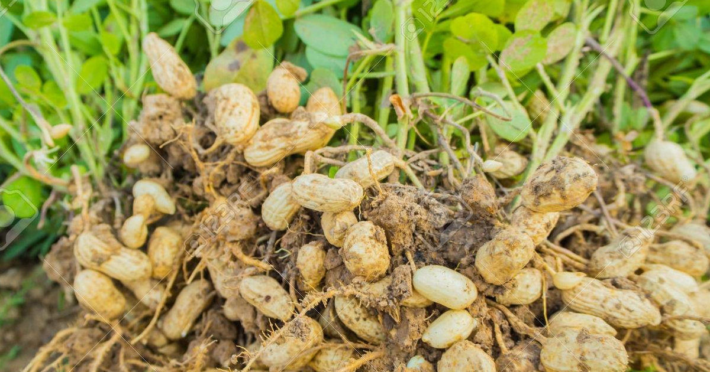
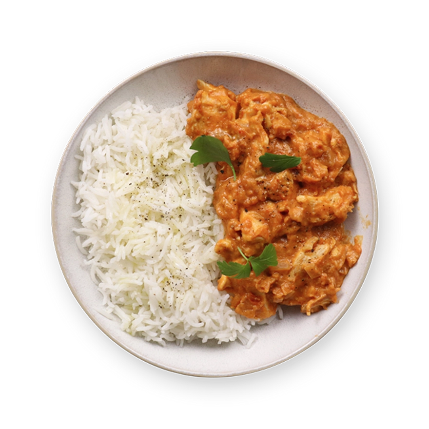
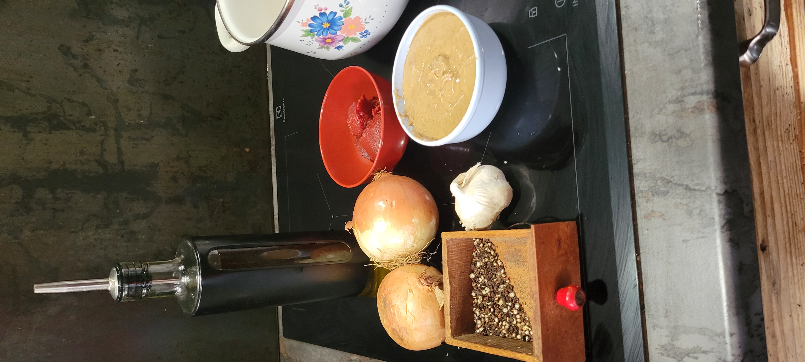
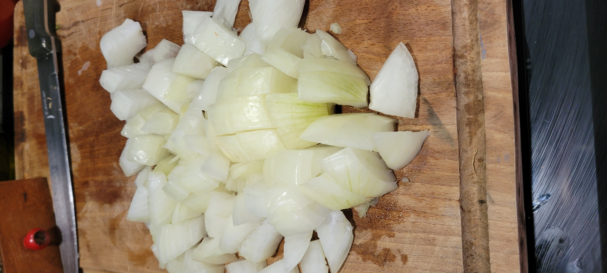
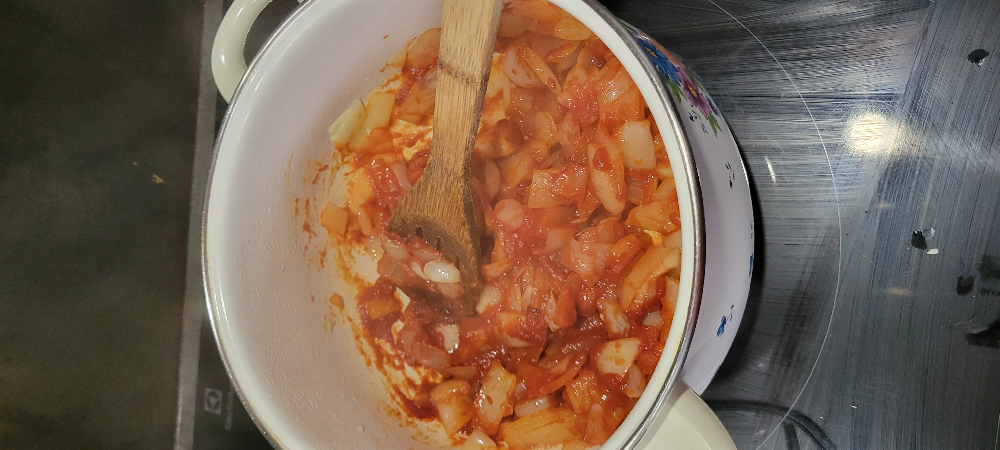
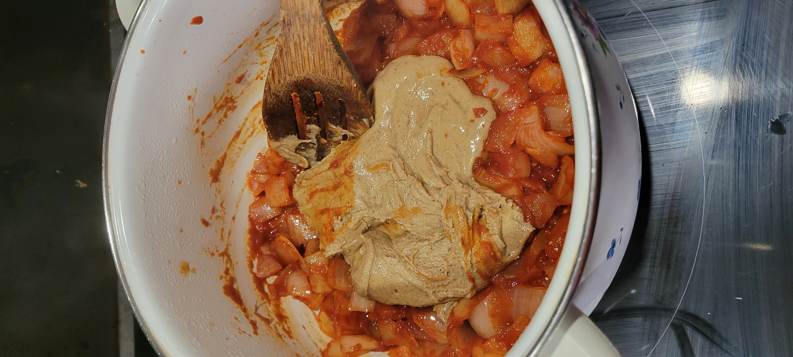
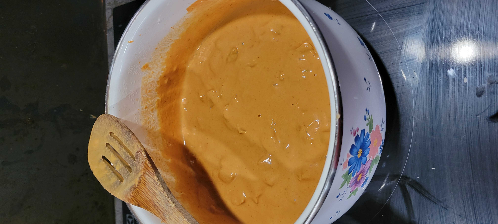
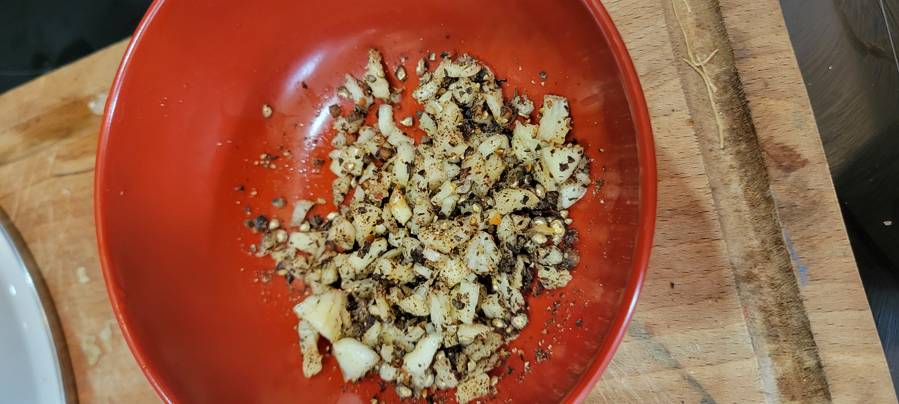
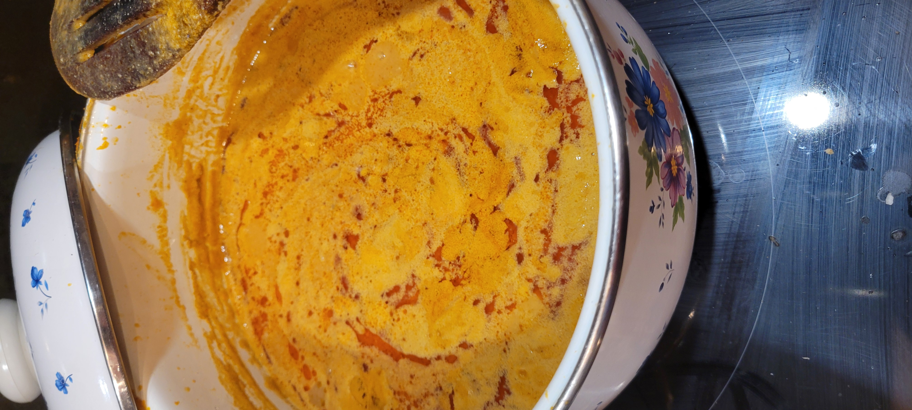

# 🍽️ Mafé

> *Comment passer de la plante au plat ?*

---

## Présentation

L'arachide c'est pas que des cacahouettes, et c'est pas que pour l'apéro !

**Temps de préparation :** ça dépend des personnes  
**Temps de cuisson :** ça dépend aussi mais faut prévoir que ça mijote  
**Temps total :** temps de préparation + temps de cuisson :-D  
**Portions :** 4/6 personnes  
**Difficulté :** ⭐⭐☆☆☆

---

## 🛒 Ingrédients

| Quantité | Ingrédient |
|:--------:|------------|
| 200 g | Pâte d'arachide |
| 2 | Oignon |
| 100 g | Concentré de tomate |
| 1 c. à soupe | huile |
| — | Sel, poivre, aïl ... |
| Légumes | Carottes, Choux (coupé grossièrement) |
| Viande ou poisson | Boeuf, Poulet, poisson ... |
---

## 👨‍🍳 Préparation

<table>
<tr>
<td width="55%" valign="middle">

### Étape 1 — Couper les oignons en dés

Couteau, planche, au boulot !  

Faite revenir les oignons jusqu'à ce qu'ils bronzent un peu.

</td>
<td width="45%" align="center">

</td>
</tr>

<tr>
<td width="45%" align="center">

</td>
<td width="55%" valign="middle">

### Étape 2 — Ajouter le concentré de tomates

Ajouter le concentré.

Mélanger pour obtenir un mélange homogène.

</td>
</tr>

<tr>
<td width="55%" valign="middle">

### Étape 3 — Ajouter la pâte d'arachide

Ajouter deux ou trois verre d'eau. A feux vif donc remuer en permanence, risque d'accrochage !

Mélanger pour obtenir un mélange homogène et ça doit être dense.

</td>
<td width="45%" align="center">

</td>
</tr>

<tr>
<td width="45%" align="center">

</td>
<td width="55%" valign="middle">

### Étape 4 — Cuisson

A ce stade, on va ajouter l'équivalent de 3 ou 4 verres d'eau.  

On monte tout ça à feux vif pedant quinzaine de minutes, tout en remuant fréquement pour éviter l'accrochage.

Une fois réduit à souhait, on rajoute un peu d'eau si l'aspect semble trop épais. La texture peut être plus ou moins fluide.  

</td>
</tr>

<tr>
<td width="55%" valign="middle">

### Étape 5 — Variantes et Options

**Légumes** : vous pouvez au choix ajouter des carrottes ou du choux qui cuiront pendant le mijotage.

**Prot** : viande ou poisson, ce que vous voulez, ça passe avec tout !

> *Adapter les ajouts des légumes et viande ou poisson en fonction du temps restant de cuisson puisque le mijotage est relativement long ...*

</td>
<td width="45%" align="center">

</td>
</tr>

<tr>
<td width="45%" align="center">

</td>
<td width="55%" valign="middle">

### Étape 6 — Assaisonnement

En fonction des goûts, soit juste saler à convenance.  

Ici en plus une petite mixture aïl poivre à ajouter sur le final.

</td>
</tr>

<tr>
<td width="55%" valign="middle">

### Étape 7 — Mijotage

A feux doux et le temps qu'il faut, le plus long, le repère est la formation de remontée d'huile en surface. 

Le riz en parallèle.

</td>
<td width="45%" align="center">

</td>
</tr>
</table>

---

## À servir avec...

Du piment à côté.

---

### Bon appétit !